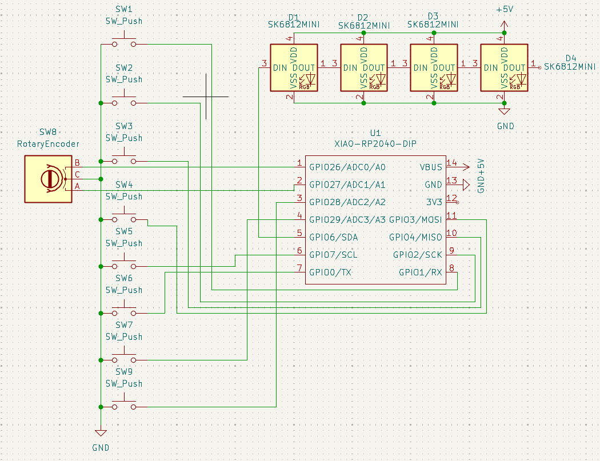
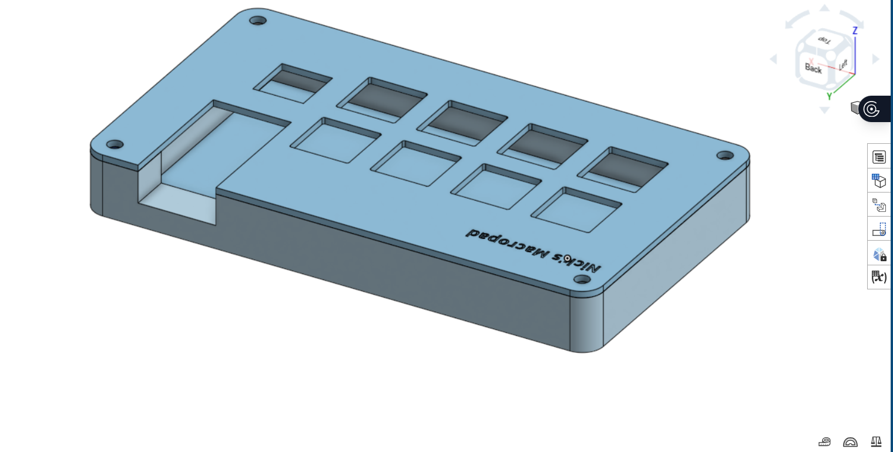
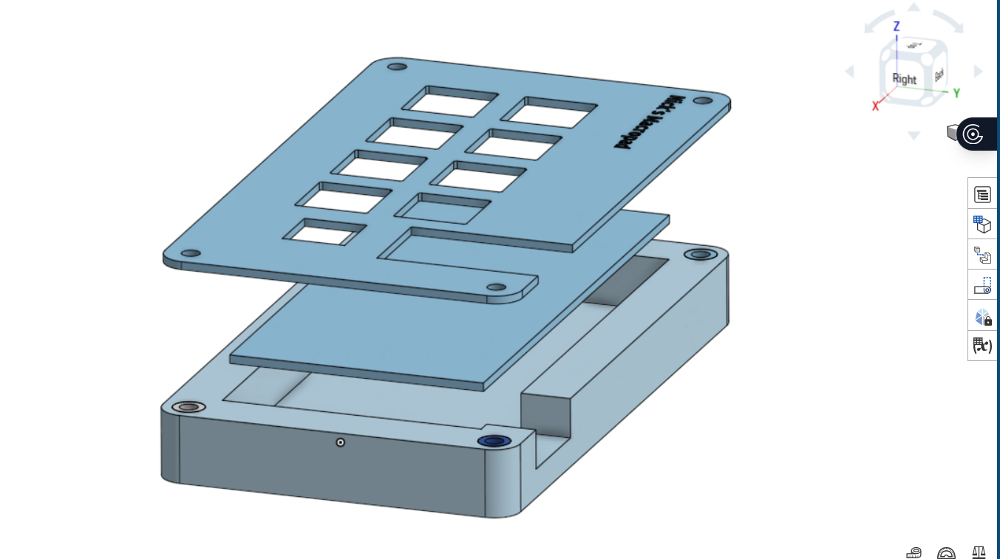

# Nick's macropad
Hi! I didn't really give this macropad a cool name like DuckiePad and just called it a generic "Nick's Macropad" (I might refer to it as "Cool Macropad" as well). My macropad has 8 keys and a rotary encoder. It uses KMK firmware. It also has 4 LEDS! I'm probably going to use this macropad for gaming or general school-use, and it can double as a desk decoration. 

# Schematic
Here's the schematic of my macropad. Shouldn't be anything too crazy. For more info, you can view the file under the PCB folder.

# PCB
Here's the PCB. The routing probably could have been more optimal as I mostly used KiCad's autorouter, but the PCB is 100 x 100mm and everything (at least electrically) works.

# CAD
I used OnShape for the 3D design instead of Fusion360, but everything still turned out okay. I attached a screenshot of the completed case, and a screenshot of an exploded view.

# Bill of Materials 
This macropad contains:
1x EC11 Rotary Encoder
1x XIAO RP2040
8x Cherry MX Switches
8x DSA Keycaps
4x SK6812 MINI-E LEDs
4x M3x16mm screws
4x M3x5mx4mm heatset inserts
1x case (2 parts)
